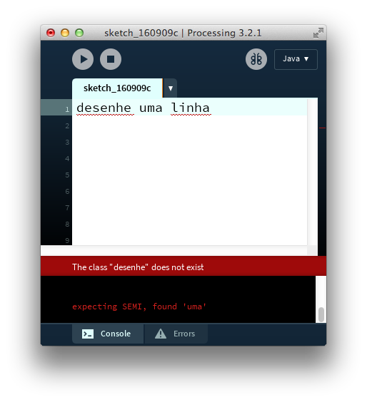
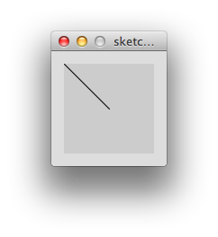

# Palavras reservadas & Argumentos #

---
 
<!-- ## Intro -->

Todo aprendizado em programação deve partir de uma realização que, em um primeiro momento, pode parecer bastante difícil de acreditar: computadores são, em essência, máquinas muito burras. 
Apesar de serem capazes de controlar o pouso e decolagem de um avião, ou de conseguirem achar - em uma fração de segundo - [centenas de fotos de gatos de chapéu](https://duckduckgo.com/?q=cats+in+a+hat&ia=images&iax=1 "São gatos. De chapéu..."), computadores ainda são dispositivos extremamente limitados nas suas capacidades.

Um computador é capaz de fazer _uma_ coisa muito bem: análise e manipulação de números. Pequenas operações matemáticas, como somar, subtrair, ou comparar dois valores numéricos diferentes. Isso um computador é capaz de fazer mais rapidamente, e com uma maior taxa de acertos do que qualquer matemático ou enxadrista (humano) jamais sonhou.

>Uma indicação como "2.5 GHz", quando apresentada junto das especificações técnicas de um processador, é um atestado dessa capacidade, literalmente sobre-humana, que os computadores possuem. 2.5 GHz é uma maneira de dizer que aquele processador é capaz de realizar,  **por segundo, 2 bilhões e meio** dessas pequenas operações matemáticas.
> Hoje em dia um laptop comum possui, muitas vezes, quatro processadores independentes, capazes de trabalhar simultâneamente realizando essas operações em paralelo.

Essa facilidade de lidar com números faz com que, por exemplo, seja extremamente fácil e rápido para um computador contar quantos números primos existe entre 0 e 10000 - uma tarefa extremamente difícil para um humano.
Em compensação, mesmo um super-computador teria muita dificuldade em, à partir de um arquivo PDF da _Crítica da Razão Pura_ de Immanuel Kant, derivar uma definição absoluta para "ética" - <strike>algo trivial para qualquer humano</strike>.
  
- Exemplo: [3 leis da robótica asimov](https://www.youtube.com/watch?v=7PKx3kS7f4A)

Talvez, então, seja mais justo dizer não que o computador é burro, mas que ele é apenas extremamente limitado no que diz respeito ao _tipo_ de instrução que ele é capaz de entender, e portanto, seguir.

---

Processing, por exemplo, é _"um flexível ambiente de rascunho, e uma linguagem para aprender a programar, dentro de um contexto de artes visuais"_ <sup>[1]</sup>. Isso significa que o Processing vai partir de um código que é, como na maior parte das linguagens de programação, apenas um arquivo de texto, irá tentar interpretar<sup>[2]</sup> esse texto e, caso consiga, responderá com um programa que provavelmente terá uma componente visual, como uma imagem, ou uma animação.

##### <center> CÓDIGO EM TEXTO -> PROCESSING -> BELAS IMAGENS </center>

De maneira similar, SuperCollider se define como _"uma plataforma para síntese de áudio e composição algoritmica, utilizada por músicos, artistas e pesquisadores que trabalham com som"_.<sup>[3]</sup> 
Em outras palavras:

##### <center> CÓDIGO EM TEXTO -> SUPERCOLLIDER -> BELOS SONS </center>

Digamos então que você queira pedir ao computador para que desenhe na tela uma linha reta - e você quer fazer esse pedido através de um código de Processing. Essa instrução poderia ser dada de diversas outras maneiras - clicar e arrastar o mouse na tela usando uma ferramenta espefícia no Photoshop por exemplo, seria uma opção. Mas você decidiu programar a sua linha usando uma linguagem de programação open source, no lugar de um software proprietário. Sábia escolha...
Uma vez que um código de Processing é, essencialmente, um arquivo de texto (uma instrução por escrito), uma tentativa válida de desenhar uma linha seria tentar pedir para que o Processing interprete o seguinte comando:

```processing
desenhe uma linha
```

A resposta, porém, não é a tão esperada linha, mas sim uma mensagem de erro, onde o Processing educadamente diz que [ele não pode obedecer a minha instrução](https://www.youtube.com/watch?v=7qnd-hdmgfk "Processing, open the  pod bay doors."), e que `The class "desenhe" does not exist`.

<!-- <center> -->

<!-- </center> -->
<!-- entre colchetes é texto de acessibilidade. entre aspas é texto de hover -->

Talvez seja uma incompatibilidade entre o fato de estar escrevendo em português, e a língua oficial de boa parte das linguagens de programação ser o inglês. Vamos tentar

```ruby
draw a line
```

e ver se o resultado é diferente.


Aparentemente não. Mesmo em inglês a mensagem de erro `The class "draw" does not exist` permanece.

Isso acontece porque o Processing não entende as palavras _"desenhe"_, ou _"linha"_. Ele as desconhece completamente, e portanto é incapaz de interpretar e reagir à elas. E um computador, ao contrário de um humano, ou de um bebê chimpanzé, é incapaz de aprender sozinho o significado de palavras novas. Um computador só entende aquilo que foi ensinado para ele, ou, em outras palavras

> ###### LINGUAGENS DE PROGRAMAÇÃO SÓ ENTENDEM AS PALAVRAS QUE FAZEM PARTE DO VOCABULÁRIO DAQUELA LINGUAGEM! 

O Processing inclusive marca as palavras que não entende com um sublinhado vermelho, de maneira similar ao corretor ortográfico de um editor de texto.
Portanto, se queremos realizar uma ação em uma linguagem de programação, _precisamos utilizar as palavras exclusivas daquela linguagem, capazes de serem corretamente interpretadas._

No Processing, o comando correto (que daqui para frente chamaremos de __função__) para desenhar uma linha é

```ruby
line();
```

Repare que a função `line();` não é _apenas a palavra line_ (isso nós tentamos, quando escrevemos em inglês), mas a palavra _line_, seguida de parênteses, e um ponto e vírgula.
Porém mesmo usando o vocabulário correto, e a _sintaxe_ correta, com a função `line();` temos outra mensagem de erro ao tentar rodar o nosso código.

; sem argumentos")

- isso se dá pq `line();`, mesmo sendo o comando correto, ainda cai na categoria de instruções genéricas que o computador não sabe interpretar. (assim como o exemplo de kant, ou as leis do assimov...)
- só line não é suficiente.
- computador é muito ruim em dedicir as coisas por conta própria. não basta "desenhe uma linha", mas "desenhe uma linha começando aqui, e indo até ali"

```javascript
funcao(argumento_1, argumento_2, ... ,  argumento_n);
```

---

```processing
line(0, 0, 50, 50);
```




## notas

<sub>(1) [http://processing.org](processing.org)</sub>
<sub>[2] Interpretar vs. compilar. Interpretar "lato sensu"</sub>
<sub>[3] Processing também faz som / SuperCollider também faz imagem</sub>

## rascunho

```processing
line(0, 0, 10, 10);
```

```processing
desenhe uma linha
```

```ruby
draw a line
```

```ruby
SinOsc.ar(freq:200, mul:0.5)
```

```ruby
Line.kr()
```
- diferença line do processing / line do SC
  - mesma (quase igual) palavra/função/comando, que duas linguagens diferentes interpretam de maneiras diferentes
  - como _embarazada_ em espanhol e _embaraçada_ em português


# referências #

Shifmann, D - Learning Processing
pp. 3-4

https://www.youtube.com/watch?v=YlRTTzlhquo
4:20
